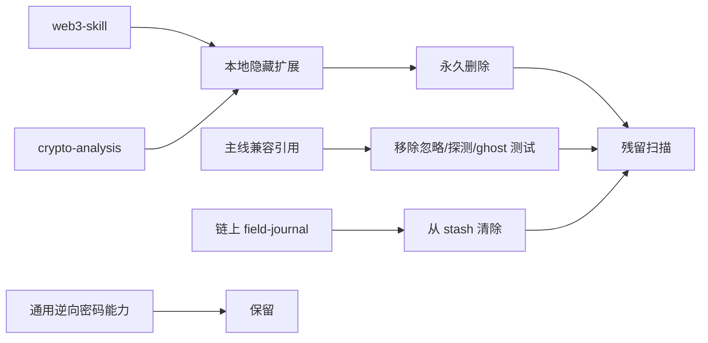

# Crypto/Web3/链上模块清理报告

## 结论

仓库不再维护独立 Crypto/Web3/链上扩展包。本地被忽略的 `web3-skill/` 与 `skills/crypto-analysis/` 已永久删除；主线中的忽略规则、工具探测、占位门禁和链上示例也已移除。

通用逆向所需的 AES、RSA、编码识别、前端参数解密等能力仍保留在 `reverse-engineering/` 与 `js-reverse/`，它们不是链上产品模块。

## 删除范围

- 本地目录：`web3-skill/`
- 本地目录：`skills/crypto-analysis/`
- stash 中的链上靓号地址 GPU 估算日志及其索引项
- `.gitignore` 中为上述目录保留的规则
- tool-index 中的链上技能/工具特殊过滤逻辑
- smoke、P0、coherence 中针对旧链上模块的 ghost 检查
- 文档中的 Web3、区块链、Bitcoin、Foundry 等产品引用

无关的支付业务审计日志已重新保存为独立 stash，没有随链上内容一起删除。

## 清理关系图

## 验证结果

| 检查 | 结果 |
|---|---|
| 路由回归 | 163 / 163 通过 |
| routing coherence / supply-chain gate | 通过 |
| smoke | 通过 |
| P0 friction / scope guard | 通过 |
| case-review Python 单测 | 8 / 8 通过（新增 Windows 绝对路径用例） |
| 当前 case 严格证据审查 | PASS，0 error / 0 warning |
| Burp bridge Node 回归 | 1 / 1 通过 |
| INDEX、JSON、YAML | 通过 |
| 生成后的 tool-index 链上残留扫描 | 0 命中 |
| 本地两个目标目录 | 均不存在 |
| 当前功能树的链上路径/内容 | 0 命中；仅保留本删除审计记录 |
